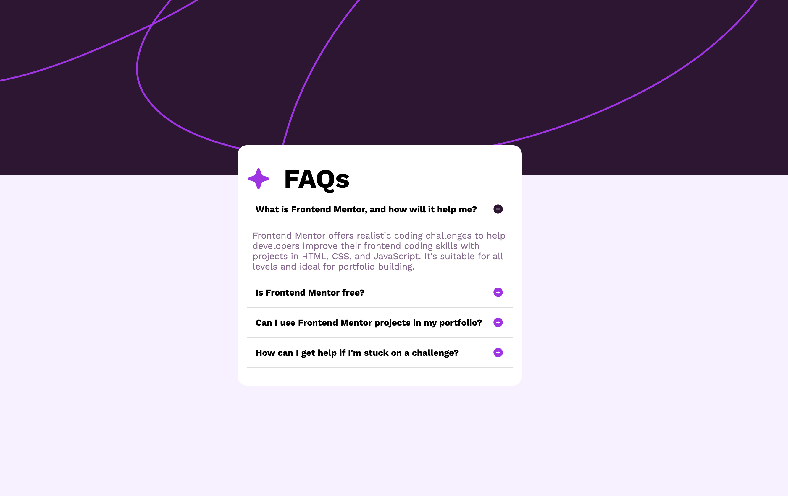

# Frontend Mentor - FAQ accordion solution

This is a solution to the [FAQ accordion challenge on Frontend Mentor](https://www.frontendmentor.io/challenges/faq-accordion-wyfFdeBwBz). Frontend Mentor challenges help you improve your coding skills by building realistic projects. 

## Table of contents

- [Overview](#overview)
  - [The challenge](#the-challenge)
  - [Screenshot](#screenshot)
  - [Links](#links)
- [My process](#my-process)
  - [Built with](#built-with)
  - [What I learned](#what-i-learned)
  - [Continued development](#continued-development)
  - [Useful resources](#useful-resources)
- [Author](#author)

## Overview

### The challenge

Users should be able to:

- Hide/Show the answer to a question when the question is clicked
- Navigate the questions and hide/show answers using keyboard navigation alone
- View the optimal layout for the interface depending on their device's screen size
- See hover and focus states for all interactive elements on the page

### Screenshot



### Links

- Solution URL: [Solution](https://www.frontendmentor.io/solutions/faq-accordion-ycAHjFxS85)
- Live Site URL: [Live Site](https://juantwofour.github.io/FAQ-accordion/)

## My process

### Built with

- Semantic HTML5 markup
- CSS custom properties
- Flexbox
- Mobile-first workflow


### What I learned

On this challenge I learned that js is not as complicated as i thought. The simple js I wrote for the collapsible parts was fairly simple to understand.

```js
function toggleCollapsible(header) {
      const content = header.nextElementSibling;
      const icon = header.querySelector('.toggle-icon');

      if (content.classList.contains('open')) {
        content.classList.remove('open');
        icon.src = './assets/images/icon-plus.svg';
      }
      else {
        content.classList.add('open');
        icon.src = './assets/images/icon-minus.svg';
      }
    }
```

### Continued development

I will continue to code and start learning javascript slowly.

### Useful resources

- [W3bSchools](https://www.w3schools.com/) - As always, awesome source for help on coding.

## Author

- Socials - [Juan Vega](https://juantwofour.github.io/Social-Profiles/)
- LinkedIn - [Juan Vega](https://www.linkedin.com/in/juan-vega-bab395282)
- Frontend Mentor - [@JuanTwoFour](https://www.frontendmentor.io/profile/JuanTwoFour)